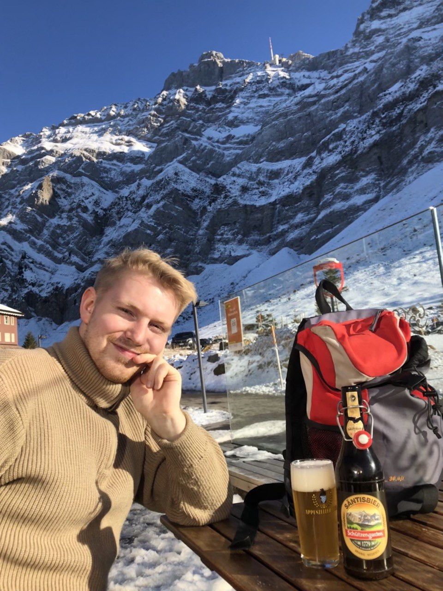

{width="50%"}

# Introduction

I am Lennart, a Master’s student of Data Science with an interest in quantitative and computational methods of Political Science. I work as a research assistant for [Max Schaub](https://maxschaub.eu/) at the University of Hamburg, currently on the [generational effect of wartime victimization on interpersonal trust and social norms](https://wargen.eu/index.html). 

Here, I mostly write about R & Python programming, and software I recommend. Thanks for stopping by!

Github: [kssrr](https://github.com/kssrr)

ORCiD: [0009-0007-0052-5973](https://orcid.org/0009-0007-0052-5973)

Mail: [lennart.kasserra@uni-hamburg.de](mailto:lennart.kasserra@uni-hamburg.de)
