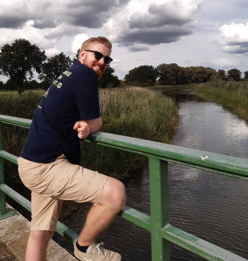

{width=500px}

# Introduction

I am Lennart, a Master’s student of Data Science with an interest in quantitative Political Science. Here, I mostly write about R & Python programming, and software I recommend. Thanks for stopping by! Note: This is currently of course still under construction…

Github: [kssrr](https://github.com/kssrr)

Mail: lennart.kasserra@uni-hamburg.de